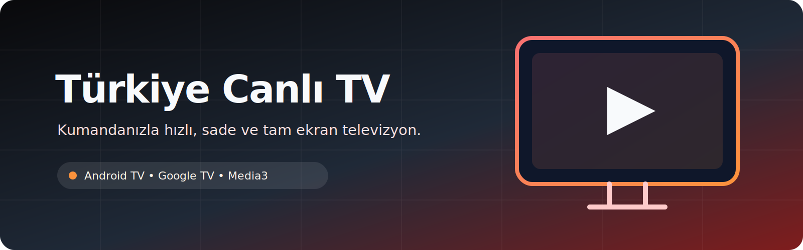

<div align="center">



# Türkiye Canlı TV

**Android TV ve Google TV için kumanda odaklı, tam ekran canlı yayın oynatıcısı.**

[](https://github.com/KayaJR356/Turkey-TV/actions/workflows/android.yml)
[](LICENSE)
[](https://github.com/KayaJR356/Turkey-TV/releases)
[](https://github.com/KayaJR356/Turkey-TV/stargazers)
[](https://github.com/KayaJR356/Turkey-TV/forks)
[](https://github.com/KayaJR356/Turkey-TV/issues)
[](https://github.com/KayaJR356/Turkey-TV/commits/main)
[](https://github.com/KayaJR356/Turkey-TV)

</div>


Türkiye Canlı TV; canlı kanal kataloğunu yenileyen, uygun HLS/DASH/MP4 akışlarını Media3 ile oynatan ve TV kumandası için tasarlanmış açık kaynak bir Android uygulamasıdır. Program rehberi, favoriler, kategoriler, ebeveyn kilidi, alternatif yayın geçişi ve çevrimdışı katalog önbelleğiyle koltuktan kullanıma odaklanır.

> [!IMPORTANT]
> Bu proje yayın içeriği barındırmaz veya yayın hakları sağlamaz. Kanal erişilebilirliği, görüntü kalitesi ve coğrafi kısıtlamalar ilgili yayıncıya bağlıdır.

## İçindekiler

- [Neden Türkiye Canlı TV?](#why)
- [Özellikler](#features)
- [Demo](#demo)
- [Kurulum](#installation)
- [Kullanım](#usage)
- [Proje yapısı](#structure)
- [Teknoloji yığını](#stack)
- [Yol haritası](#roadmap)
- [Katkı sağlama](#contributing)
- [Lisans](#license)
- [İletişim ve destek](#contact)
- [Teşekkürler](#acknowledgements)

<a id="why"></a>
## Neden Türkiye Canlı TV?

| İhtiyaç | Türkiye Canlı TV'nin yaklaşımı |
| --- | --- |
| TV'de kolay gezinme | D-pad, numara, renkli işlev ve medya tuşlarına uygun arayüz |
| Kesintisiz oynatma | Media3 ile yerel yayın; doğrudan akış yoksa güvenli web oynatıcıya otomatik geçiş |
| Güncel kanal listesi | Uygulama açılışında katalog yenileme ve eksik sonuçları reddetme |
| Kesintilere dayanıklılık | Son eksiksiz kataloğu cihazda saklama ve yayın hatasını yeniden deneme |
| Büyük ekran okunabilirliği | 10-foot arayüz, yüksek kontrastlı odak ve belirgin kanal paneli |
| Kişisel TV deneyimi | Favoriler, son izlenenler, program rehberi, PIN kilidi ve ayar yedeği |

<a id="features"></a>
## ✨ Özellikler

- Android TV ve Google TV Leanback başlatıcı desteği
- Kaynak katalogdaki tüm kanalları eksiltmeden listeleme
- HLS ve DASH akışlarını Media3 ile uyarlanabilir kalitede oynatma
- Yerel akış bulunamayan YouTube, dış iframe ve yayıncı kaynaklarını uygulama içi web oynatıcıda açma
- Android 6 dahil güvenilir YouTube, Castr ve yayıncı web oynatıcı yönlendirmeleri
- Web oynatıcıdayken `Program + / -` ile kanal değiştirme
- TRT kanalları için doğrulanmış resmî HLS akışlarını tercih etme
- İç içe oynatıcı sayfalarında üç seviyeye kadar doğrudan akış çözümleme
- Kanal adına göre arama ve numarayla doğrudan kanal seçimi
- Kaynak sitenin kategori etiketleriyle Ulusal, Haber, Spor, Çocuk, Belgesel, Dini ve Yerel filtreleri
- Favori kanallar ve son izlenen 20 kanala hızlı erişim
- Açılışta yenilenen, çevrimdışı önbellekli şimdi/sonra program rehberi (EPG)
- Kanal satırlarında yerel/alternatif/geçici sorun yayın durumu; hiçbir kanal sağlık sonucuyla silinmez
- Son izlenen kanal, başlangıç davranışı, otomatik oynatma ve bilgi süresi ayarları
- Orijinal, yakınlaştır ve ekranı doldur görüntü oranı seçenekleri
- Otomatik, 480p, 720p ve 1080p kalite sınırı; mevcut ses ve altyazı dili seçimi
- Android medya oturumu ile sistem oynatma denetimi ve destekleyen cihazlarda görüntü içinde görüntü
- PIN ile kanal kilidi; favori, kilit, geçmiş ve ayarları JSON dosyasına yedekleme/geri yükleme
- Son eksiksiz kanal kataloğunu cihazda güvenli biçimde önbelleğe alma
- Ağ ve önbellek çalışmasa bile 285 kanalı açan APK içi başlangıç kataloğu
- Bozuk akışta alternatif URL deneme ve komşu kanalları arka planda ön çözümleme
- Kırmızı tuşla elle yayın yenileme
- Cihaz açılışında uygulamayı otomatik başlatma seçeneği
- GitHub Release sürümlerini açılışta otomatik denetleme, APK indirme ve SHA-256 doğrulama
- Bağlantı geri geldiğinde seçili yayını otomatik yenileme
- 720p, 1080p ve 4K TV'lerde kompakt kanal kartları ve uyarlanabilir arayüz ölçeği
- Cihaz açılışında üretici TV uygulamasından sonra iki gecikmeli yeniden öne alma denemesi
- Oynatma başlayınca kendiliğinden gizlenen üst durum göstergesi
- Menü açıp kapatıldığında kesintisiz oynatma
- Her push ve pull request'te debug APK derleme ve Android Lint kontrolü

> [!NOTE]
> Kanal sayısı 21 Temmuz 2026 tarihli katalog doğrulamasına dayanır. Kaynak katalog değiştikçe sayı ve erişilebilirlik değişebilir.

<a id="demo"></a>
## 🎬 Demo

- **Sürüm sayfası:** [v3.5.2](https://github.com/KayaJR356/Turkey-TV/releases/tag/v3.5.2)
- **CI çıktısı:** Başarılı GitHub Actions çalışmasındaki `TurkiyeCanliTV-debug` artifact'i

<a id="installation"></a>
## Kurulum

### Kaynaktan derleme

#### Gereksinimler

- JDK 17
- Android SDK 35
- Gradle 8.9
- Git

```bash
git clone https://github.com/KayaJR356/Turkey-TV.git
cd Turkey-TV
gradle :app:assembleDebug
```

Derlenen APK:

```text
app/build/outputs/apk/debug/app-debug.apk
```

ADB ile bağlı TV cihazına yüklemek için:

```bash
adb install -r app/build/outputs/apk/debug/app-debug.apk
```

> [!IMPORTANT]
> `v3.4.0` ve sonraki Release APK'ları aynı kalıcı güncelleme anahtarıyla imzalanmalıdır.
> Eski, farklı bir debug anahtarıyla kurulmuş sürümün üzerine ilk imzalı sürüm kurulamaz; bu
> geçişte eski uygulamayı bir kez kaldırıp imzalı APK'yı yeniden kurmak gerekir.

Derleme ve lint kontrollerini birlikte çalıştırmak için:

```bash
gradle :app:assembleDebug :app:lint
```

<a id="usage"></a>
## 🎮 Kullanım

İlk açılışta başlangıç davranışını seçin. Ardından kumandanızla kanal değiştirebilir, kanal listesinde gezinebilir ve oynatma ayarlarını yönetebilirsiniz.

`Ayarlar > Cihaz açılışı` seçeneğini **Bu uygulamayı başlat** olarak ayarlarsanız destekleyen Android TV cihazlarında uygulama cihaz açıldıktan sonra otomatik başlar. Bazı üretici yazılımları arka plandan başlatmayı engelleyebilir.

Uygulama açılışta en fazla altı saatte bir GitHub sürümlerini denetler. Yeni sürüm bulunduğunda
APK uygulama içinde indirilir ve SHA-256 ile doğrulanır. Android güvenliği nedeniyle son kurulum
onayı sistem ekranında kullanıcı tarafından verilir. `Ayarlar > Uygulama güncellemesini denetle`
seçeneğiyle denetim elle de başlatılabilir.

Bir kanal için doğrulanmış HLS/DASH/MP4 adresi bulunamazsa uygulama kanalı listeden kaldırmaz;
aynı kanalın `canlitv.diy` web oynatıcısını otomatik açar. Web oynatıcıdan Geri ile kanal
rehberine dönebilir, `Program + / -` ile doğrudan sonraki veya önceki kanala geçebilirsiniz.

Kanal rehberinin üstündeki sekmelerden kategori, favori veya son izlenen filtresi seçilebilir.
Bir kanal satırında OK tuşunu basılı tutmak favoriyi değiştirir. Normal OK, izleme ekranında
kanal listesini; `Bilgi` program ayrıntısını açar. Ayarlar içindeki kütüphane ve güvenlik
bölümünden kanal kilidi, ebeveyn PIN'i ve JSON ayar yedeği yönetilir.

| Tuş | İşlev |
| --- | --- |
| `Program + / -` | Sonraki / önceki kanal |
| `0–9` | Kanal numarasına doğrudan git |
| `OK`, Menü veya Rehber | Kanal listesini aç |
| Yön tuşları | Kanal ve ayar menülerinde gezin |
| Sağ veya Geri | Açık menüyü kapat |
| Kırmızı | Geçerli yayını yeniden başlat |
| Yeşil veya Arama | Kanal adına göre ara |
| Sarı | Kanal listesini aç / kapat |
| Ayarlar veya Mavi | Ayarları aç / kapat |
| Bilgi | Kanal bilgisini göster |
| Oynat / Duraklat | Yayını oynat veya duraklat |

Yayın çözümleme ve hata toleransı ayrıntıları için [mimari belgesine](docs/ARCHITECTURE.md), kabul adımları için [test belgesine](docs/TESTING.md) bakın.

<a id="structure"></a>
## 🗂️ Proje yapısı

```text
Turkey-TV/
├── .github/
│   ├── ISSUE_TEMPLATE/          # Yapılandırılmış issue formları
│   ├── workflows/android.yml    # Build, lint ve APK artifact iş akışı
│   ├── workflows/release.yml    # İmzalı APK ve SHA-256 GitHub Release'i
│   └── PULL_REQUEST_TEMPLATE.md
├── app/
│   ├── build.gradle             # Android uygulama yapılandırması
│   └── src/main/
│       ├── AndroidManifest.xml
│       ├── java/tv/kaya/turksat/
│       │   ├── BootReceiver.java
│       │   ├── AppUpdateManager.java
│       │   ├── Channel.java
│       │   ├── ChannelRepository.java
│       │   ├── ChannelStatus.java
│       │   ├── ChannelUserData.java
│       │   ├── EpgProgram.java
│       │   ├── EpgRepository.java
│       │   ├── MainActivity.java
│       │   ├── SplashActivity.java
│       │   └── WebPlayerActivity.java
│       └── res/                 # TV arayüzü kaynakları
├── docs/
│   ├── ARCHITECTURE.md
│   ├── RELEASING.md
│   └── TESTING.md
├── build.gradle
└── settings.gradle
```

<a id="stack"></a>
## 🧰 Teknoloji yığını

| Katman | Teknoloji |
| --- | --- |
| Dil | Java |
| Platform | Android TV / Google TV |
| Android SDK | Compile/Target 35, Minimum 23 |
| Oynatıcı | AndroidX Media3 1.5.1 (ExoPlayer, HLS, DASH, UI, MediaSession) |
| Katalog | jsoup 1.22.2 ile dayanıklı HTML ayrıştırma |
| Arayüz | Android Views, AppCompat 1.7.0, Leanback launcher |
| Build | Gradle 8.9, Android Gradle Plugin 8.7.3, JDK 17 |
| CI | GitHub Actions |

<a id="roadmap"></a>
## 🛣️ Yol haritası

- [x] Kumanda odaklı tam ekran TV arayüzü
- [x] HLS/DASH çözümleme ve Media3 oynatma
- [x] Kanal arama, ayarlar ve katalog önbelleği
- [x] CI üzerinde debug build ve Android Lint
- [x] Sürümlenmiş GitHub Release ve SHA-256 checksum
- [x] GitHub Release tabanlı uygulama içi güncelleme ve checksum doğrulama
- [x] Tam kaynak kataloğu ve yerel akış bulunamadığında güvenli web oynatıcı
- [x] Alternatif akış geçişi ve komşu kanal ön çözümlemesi
- [x] İsteğe bağlı cihaz açılışında otomatik başlatma
- [x] Kompakt TV arayüzü ve bağlantı geri geldiğinde otomatik yayın yenileme
- [x] Üretim anahtarıyla imzalı kararlı APK dağıtımı
- [x] Sürüm ve katalog ayrıştırıcı birim testleri
- [x] Favoriler, kategoriler, son izlenenler ve yayın durumları
- [x] Şimdi/sonra program rehberi ve kanal program akışı
- [x] Kalite, ses, altyazı, medya oturumu ve görüntü içinde görüntü
- [x] Ebeveyn PIN'i, kanal kilidi ve ayar yedekleme/geri yükleme
- [x] Çevrimdışı başlangıç kataloğu ve API 23 gerçek açılış testi

Planlanan çalışma için [issue'lara](https://github.com/KayaJR356/Turkey-TV/issues) bakın. Yeni bir yön önermeden önce [feature request](https://github.com/KayaJR356/Turkey-TV/issues/new?template=feature_request.yml) açın.

<a id="contributing"></a>
## 🤝 Katkı sağlama

Katkılar değerlidir. Başlamadan önce [CONTRIBUTING.md](CONTRIBUTING.md) ve [CODE_OF_CONDUCT.md](CODE_OF_CONDUCT.md) belgelerini okuyun.

1. Uygun issue formuyla değişikliği tartışın.
2. Repository'yi fork'layın ve odaklı bir branch oluşturun.
3. Değişikliğinizi build ve lint ile doğrulayın.
4. Küçük, açıklayıcı commit'ler oluşturun.
5. Pull request şablonunu eksiksiz doldurun.

Güvenlik açığı bildirimleri için issue açmayın; [SECURITY.md](SECURITY.md) politikasını izleyin.

<a id="license"></a>
## 📄 Lisans

Kaynak kod [MIT Lisansı](LICENSE) ile sunulur.

Kanal adları, logoları, yayınları ve üçüncü taraf hizmetleri kendi sahiplerinin mülkiyetindedir. MIT Lisansı üçüncü taraf içerikleri için kullanım veya dağıtım hakkı vermez.

<a id="contact"></a>
## 💬 İletişim ve destek

- Hata bildirimi: [Bug report](https://github.com/KayaJR356/Turkey-TV/issues/new?template=bug_report.yml)
- Özellik önerisi: [Feature request](https://github.com/KayaJR356/Turkey-TV/issues/new?template=feature_request.yml)
- Kullanım desteği: [SUPPORT.md](SUPPORT.md)
- Güvenlik bildirimi: [SECURITY.md](SECURITY.md)
- Bakımcı: [@KayaJR356](https://github.com/KayaJR356)

<a id="acknowledgements"></a>
## 🙏 Teşekkürler

- [AndroidX Media3](https://developer.android.com/media/media3) ekibine
- Android TV ve açık kaynak Android ekosistemine
- Katalog bilgisini sağlayan kaynaklara ve yayınlarını erişilebilir kılan yayıncılara
- Hata bildiren, belge geliştiren ve kod katkısı sağlayan tüm katılımcılara

---

<div align="center">
Türkiye Canlı TV'yi yararlı bulduysanız repository'yi ⭐ ile destekleyebilirsiniz.
</div>
